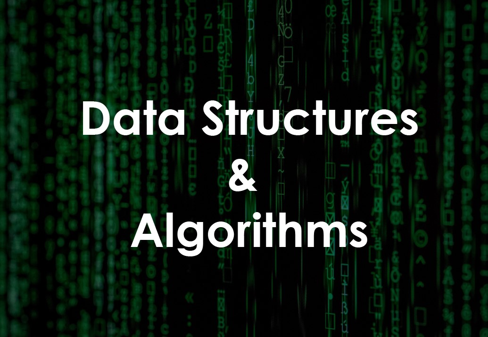

# Topics/Problems Done

### Arrays

- Insertion Into Array
- Remove Duplicate Elements from the array
- Array Manipulation-1 [HackerRank problem](https://www.hackerrank.com/challenges/crush/problem)
- Merge two sorted arrays in to a third sorted array
- Array Game-1(Leap Game) [HackerRank problem](https://www.hackerrank.com/challenges/java-1d-array/problem)

---

### Stacks

- Linear Stack (Using array) {Push, Pop, Display, IsEmpty, IsFull}

---

### Queues

- Linear Queue (Using array) {Insert, Remove, Display, IsEmpty, IsFull}

---

### Sorting

- Selection Sort (Iterative)
- Bubble Sort (Iterative)
- Bubble Sort (Recursive)
- Insertion Sort (Iterative)
- Insertion Sort (Recursive)
- Merge Sort (Recursive)
- Quick Sort (Recursive)

---

### Linked List

- Linked List (Finding the nth-node from the end of the list)
- Two Linked List Problem(Find pairs from two linked Lists, sum of which is equal to given number)
- Merge two pre-sorted linked lists

---
